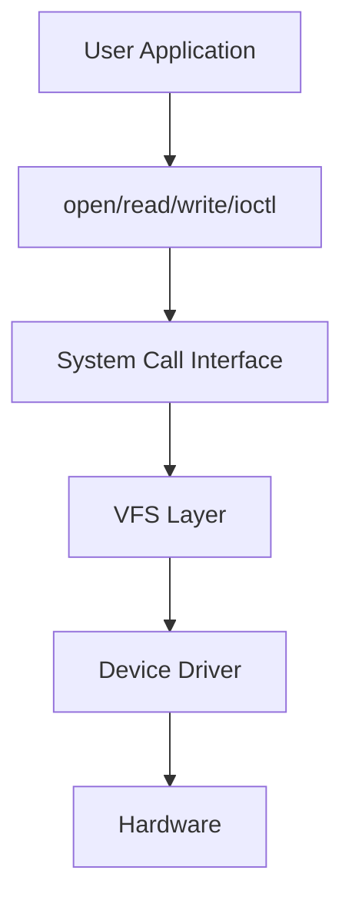

# Linux Device Driver Introduction

## 1. What is a Device Driver?

A **device driver** is a software component that runs inside the Linux Kernel and controls a hardware device.

The user application does not access the hardware directly.
Instead, the application asks the kernel to access the hardware, and the kernel uses the correct driver to control that hardware.

```text
User Application
      |
      v
Linux Kernel
      |
      v
Device Driver
      |
      v
Hardware
```

Examples of hardware devices that need drivers:

```text
GPIO
LED
Button
UART
SPI
I2C
USB
Sensor
Camera
Hard Disk
Wi-Fi
Ethernet
```

---

## 2. Why Do We Need Device Drivers?

Device drivers are important because they make hardware usable by the operating system.

Without a driver:

```text
Linux cannot understand the hardware
Applications cannot use the hardware
The hardware exists but is not usable
```

With a driver:

```text
Linux can detect the hardware
Applications can use the hardware
The hardware can be controlled safely
```

Example:

If we have an LED connected to a GPIO pin, the application may only say:

```text
Turn LED ON
```

But the hardware needs a low-level operation like:

```text
Write 1 to a specific GPIO register
```

So the driver translates the application request into a real hardware operation.

```text
Application: Turn LED ON
Driver: Write 1 to GPIO register
Hardware: LED turns ON
```

---

## 3. Main Idea of a Device Driver

The main job of a driver is to act as a bridge between software and hardware.

```text
High-level request
from application
        |
        v
Device Driver
        |
        v
Low-level hardware operation
```

Example:

```text
Application request:
"Send this data over UART"

Driver operation:
Write data into UART hardware registers

Hardware result:
UART sends the data physically
```

---

## 4. User Space vs Kernel Space

Linux is divided into two main areas:

```text
1. User Space
2. Kernel Space
```

---

## 5. User Space

**User Space** is where normal applications run.

Examples:

```text
Terminal
Browser
Python script
C application
Qt application
ROS node
```

A normal user application can call functions like:

```c
open();
read();
write();
close();
ioctl();
```

But it cannot access hardware registers directly.

---

## 6. Kernel Space

**Kernel Space** is where the Linux Kernel runs.

It contains important system components such as:

```text
Process Scheduler
Memory Management
File System
Network Stack
Device Drivers
```

Device drivers run in Kernel Space because they need low-level access to hardware.

```text
User Space
------------------------------------------------
Normal Applications

Kernel Space
------------------------------------------------
Linux Kernel
Device Drivers
Hardware Access
```

---

## 7. Why Applications Cannot Access Hardware Directly

Linux separates User Space and Kernel Space for protection.

If any normal application could access hardware or memory directly, one wrong program could crash the whole system.

Bad scenario:

```text
Application writes to wrong memory address
        |
        v
Kernel memory corrupted
        |
        v
System crash / Kernel panic
```

Correct scenario:

```text
Application
    |
    | system call
    v
Kernel
    |
    v
Driver
    |
    v
Hardware
```

---

## 8. How User Space Talks to Kernel Space

User Space talks to Kernel Space using **system calls**.

Common system calls used with drivers:

```c
open();
read();
write();
close();
ioctl();
```

Example:

```c
fd = open("/dev/mydevice", O_RDWR);
write(fd, "1", 1);
read(fd, buffer, size);
close(fd);
```

The application only sees a file like:

```text
/dev/mydevice
```

But behind this file, there is a driver inside the kernel.

---

## 9. System Call Flow

When the application calls `write()`:

```text
User Application
      |
      | write(fd, "1", 1)
      v
System Call Interface
      |
      v
VFS Layer
      |
      v
Driver write function
      |
      v
Hardware Register
```

### Mermaid Diagram



---

## 10. What is `/dev`?

`/dev` is a directory that contains **device files**.

Examples:

```text
/dev/ttyUSB0
/dev/sda
/dev/i2c-1
/dev/input/event0
/dev/mydevice
```

These files are not normal text files.
They are interfaces between User Space and Kernel Drivers.

```text
Application
    |
    v
/dev/mydevice
    |
    v
Driver inside Kernel
    |
    v
Hardware
```

---

## 11. Everything is a File

In Linux, many things are represented as files.

This idea is called:

```text
Everything is a file
```

So the application can use the same functions with many devices:

```c
open();
read();
write();
close();
```

Example with an LED driver:

```bash
echo 1 > /dev/myled
```

This does not write to a normal text file.

It calls the driver's `write()` function.

```text
echo 1 > /dev/myled
        |
        v
write() system call
        |
        v
myled_driver_write()
        |
        v
GPIO register = 1
        |
        v
LED ON
```

Example with a button driver:

```bash
cat /dev/mybutton
```

This calls the driver's `read()` function.

```text
cat /dev/mybutton
        |
        v
read() system call
        |
        v
mybutton_driver_read()
        |
        v
Read GPIO pin
        |
        v
Return 0 or 1 to user
```

---

## 12. Major Number and Minor Number

Linux uses two numbers to connect a device file with its driver:

```text
Major Number
Minor Number
```

### Major Number

The **major number** identifies the driver.

### Minor Number

The **minor number** identifies the specific device handled by that driver.

Example:

```text
One LED driver controls three LEDs

/dev/led0 -> major 240, minor 0
/dev/led1 -> major 240, minor 1
/dev/led2 -> major 240, minor 2
```

All three devices use the same driver, but each one has a different minor number.

---

## 13. Checking Device Files

You can check a device file using:

```bash
ls -l /dev/ttyUSB0
```

Example output:

```text
crw-rw---- 1 root dialout 188, 0 /dev/ttyUSB0
```

Important parts:

```text
c      -> character device
188    -> major number
0      -> minor number
```

Another example:

```bash
ls -l /dev/sda
```

Example output:

```text
brw-rw---- 1 root disk 8, 0 /dev/sda
```

Important parts:

```text
b   -> block device
8   -> major number
0   -> minor number
```

---

## 14. Types of Device Drivers

Linux device drivers are commonly divided into three main types:

```text
1. Character Device Drivers
2. Block Device Drivers
3. Network Device Drivers
```

---

## 15. Character Device Driver

A **character device driver** handles data as a stream of bytes.

Examples:

```text
UART
GPIO
I2C
SPI
LED
Button
Sensor
```

Character devices usually appear in `/dev`.

Examples:

```text
/dev/ttyUSB0
/dev/i2c-1
/dev/myled
/dev/mybutton
```

They usually support operations like:

```c
open();
read();
write();
close();
ioctl();
```

Flow example:

```text
Application
    |
    | open/read/write
    v
/dev/mydevice
    |
    v
Character Driver
    |
    v
Hardware
```

---

## 16. Block Device Driver

A **block device driver** handles data in blocks.

Examples:

```text
Hard Disk
SSD
SD Card
USB Flash
eMMC
```

Block devices usually appear as:

```text
/dev/sda
/dev/sdb
/dev/mmcblk0
```

Block devices are commonly used by file systems.

```text
Application
    |
    v
File System
    |
    v
Block Driver
    |
    v
Storage Hardware
```

---

## 17. Network Device Driver

A **network device driver** handles network packets.

Examples:

```text
Ethernet
Wi-Fi
CAN
```

Network devices do not usually appear as normal `/dev` files.
They appear as network interfaces.

Examples:

```text
eth0
wlan0
can0
```

You can see them using:

```bash
ip link
```

Network driver flow:

```text
Application
    |
    v
Socket API
    |
    v
TCP/IP Stack
    |
    v
Network Driver
    |
    v
Network Hardware
```

---

## 18. Device Driver Types Summary

| Type             | Data Style      | Examples             | Common Interface        |
| ---------------- | --------------- | -------------------- | ----------------------- |
| Character Driver | Stream of bytes | UART, GPIO, I2C, SPI | `/dev/mydevice`         |
| Block Driver     | Blocks of data  | HDD, SSD, SD Card    | `/dev/sda`              |
| Network Driver   | Packets         | Ethernet, Wi-Fi, CAN | `eth0`, `wlan0`, `can0` |

---

## 19. What is a Kernel Module?

A **kernel module** is code that can be loaded into the Linux Kernel at runtime.

This means we do not need to rebuild the full Linux Kernel every time we write or modify a driver.

Kernel module files usually have this extension:

```text
.ko
```

Example:

```text
hello_driver.ko
my_led_driver.ko
```

---

## 20. Why Use Kernel Modules?

Kernel modules make driver development easier.

Instead of doing this:

```text
Modify driver
Build full kernel
Reboot system
Test driver
```

We can do this:

```text
Modify driver
Build module only
Load module
Test driver
Remove module
Modify again
```

---

## 21. Kernel Module Flow

```text
Write driver code
        |
        v
Build module
        |
        v
my_driver.ko
        |
        v
sudo insmod my_driver.ko
        |
        v
Driver is loaded into kernel
        |
        v
sudo rmmod my_driver
        |
        v
Driver is removed from kernel
```

---

## 22. Important Kernel Module Functions

A kernel module usually has two main functions:

```text
init function
exit function
```

The init function runs when the module is loaded.

The exit function runs when the module is removed.

```text
sudo insmod hello.ko
        |
        v
module_init function runs

sudo rmmod hello
        |
        v
module_exit function runs
```

---

## 23. Simple Kernel Module Example

```c
#include <linux/module.h>
#include <linux/kernel.h>
#include <linux/init.h>

static int __init hello_init(void)
{
    printk(KERN_INFO "Hello from kernel module\n");
    return 0;
}

static void __exit hello_exit(void)
{
    printk(KERN_INFO "Goodbye from kernel module\n");
}

module_init(hello_init);
module_exit(hello_exit);

MODULE_LICENSE("GPL");
MODULE_AUTHOR("Ayman");
MODULE_DESCRIPTION("Simple Hello Kernel Module");
```

---

## 24. Important Kernel Module Commands

Check the current kernel version:

```bash
uname -r
```

List loaded kernel modules:

```bash
lsmod
```

Load a kernel module:

```bash
sudo insmod hello.ko
```

Remove a kernel module:

```bash
sudo rmmod hello
```

Check kernel logs:

```bash
dmesg | tail
```

Show module information:

```bash
modinfo hello.ko
```

---

## 25. `printk()` vs `printf()`

In User Space, we use:

```c
printf("Hello\n");
```

In Kernel Space, we use:

```c
printk(KERN_INFO "Hello from kernel\n");
```

Kernel messages can be viewed using:

```bash
dmesg
```

Example:

```bash
dmesg | tail
```

---

## 26. Why Kernel Code Must Be Written Carefully

A kernel module runs in Kernel Space.

This means it has high privileges.

A bug in a normal application may only crash the application.

But a bug in kernel code may crash the whole system.

Possible results of kernel bugs:

```text
System freeze
Kernel panic
Unexpected reboot
Memory corruption
Security issue
```

So driver code must be written carefully.

---

## 27. Full Device Driver Communication Flow

```text
+----------------------+
|   User Application   |
+----------------------+
           |
           | open/read/write/ioctl
           v
+----------------------+
|     Device File      |
|   /dev/mydevice      |
+----------------------+
           |
           v
+----------------------+
|    Linux Kernel      |
|    VFS Layer         |
+----------------------+
           |
           v
+----------------------+
|   Device Driver      |
+----------------------+
           |
           v
+----------------------+
|      Hardware        |
+----------------------+
```

---
